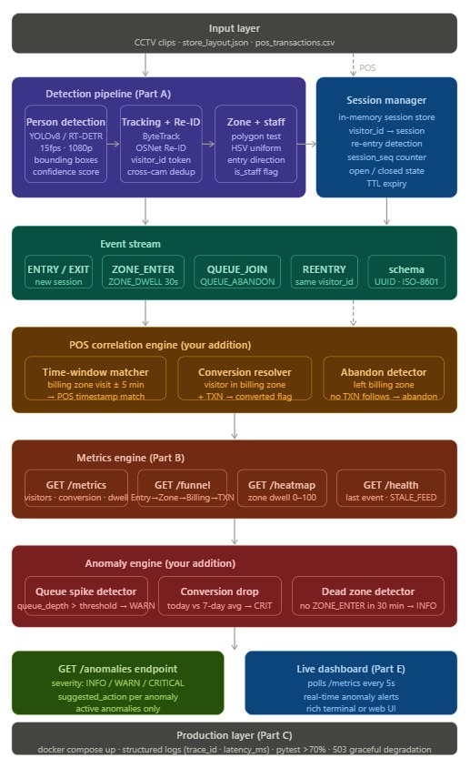

# Store Intelligence API
> End-to-end retail analytics pipeline: Raw CCTV footage → Real-time store metrics

---

## What This Does
Transforms raw CCTV footage from physical retail stores into actionable 
business intelligence — the same way online stores track sessions, 
clicks, and conversions.

**North Star Metric:** Offline Store Conversion Rate  
`Conversion Rate = Visitors who purchased ÷ Total unique visitors`

---

## Architecture


---

## Dataset Used
- **5 CCTV cameras** — Brigade Road Purplle store, Bangalore
- **Real POS transactions** — Brigade Bangalore April 2026
- **Real store layout** — Brigade Road floor plan zones

**Results on real footage:**
- 942 events generated across 5 cameras
- Zones detected: FOH, CASH_COUNTER, ENTRY_LOBBY, FRAGRANCE, MAKEUP_UNIT
- 224 unique visitors tracked

---

## Setup (5 commands)
```bash
git clone <repo-url>
cd store-intelligence
cp .env.example .env
docker compose up --build
python data/seed_events.py
```

---

## Run Detection Pipeline
```bash
# Process a camera clip
python pipeline/detect.py \
  --video data/clips/CAM1.mp4 \
  --store-id STORE_BLR_002 \
  --camera-id CAM_ENTRY_01 \
  --output data/events.jsonl

# Feed events into API
python pipeline/emit.py \
  --input data/events.jsonl \
  --api-url http://localhost:8000
```

---

## API Endpoints

| Method | Endpoint | Description |
|--------|----------|-------------|
| POST | `/events/ingest` | Ingest batch of events (idempotent) |
| GET | `/stores/{id}/metrics` | Unique visitors, conversion rate, dwell time |
| GET | `/stores/{id}/funnel` | Entry → Zone → Billing → Purchase drop-off |
| GET | `/stores/{id}/heatmap` | Zone visit frequency normalised 0-100 |
| GET | `/stores/{id}/anomalies` | Queue spike, conversion drop, dead zones |
| GET | `/health` | Feed status, STALE_FEED warnings |

---

## Live Dashboard
```bash
python dashboard/live.py
```
Rich terminal dashboard polling metrics every 5 seconds with 
real-time anomaly alerts colored by severity.

---

## Run Tests
```bash
pytest tests/ -v
# 15/15 tests passing
# Edge cases: empty store, staff exclusion, 
# re-entry dedup, zero purchases, idempotency
```

---

## Key Engineering Decisions

**Detection Model — YOLOv8n over RT-DETR**  
Chose speed and ecosystem maturity over marginal occlusion improvement. 
Compensated by lowering confidence threshold to 0.3.

**Storage — SQLite over PostgreSQL**  
Zero setup, sufficient for challenge scale, single Docker service. 
SQLAlchemy ORM means one-line swap to Postgres for production.

**Event Schema — Single table with JSON metadata**  
8 event types with different metadata shapes. Single insert path 
simpler to maintain than per-type tables.

Full reasoning in [DESIGN.md](docs/DESIGN.md) and [CHOICES.md](docs/CHOICES.md)

---

## Tech Stack
- **Detection:** YOLOv8n, ByteTrack, OpenCV
- **API:** FastAPI, SQLAlchemy, SQLite, Pydantic
- **Infrastructure:** Docker, uvicorn
- **Dashboard:** rich
- **Testing:** pytest, FastAPI TestClient

